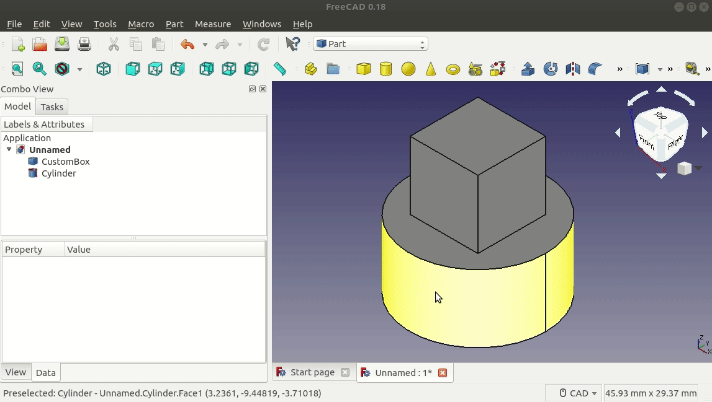
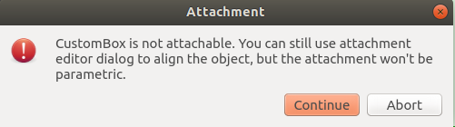

# FreeCAD Part Attachment Python Example
The purpose of this repository is to show a minimal example of [FreeCAD's Part Attachment Feature](https://wiki.freecadweb.org/Part_Attachment) in Python using [scripted objects](https://wiki.freecadweb.org/FeaturePython_Objects) in Python.

See [PartAttachmentExample.FCMacro](./PartAttachmentExample.FCMacro) for the full and complete example.

The following **GIF** demonstrates attaching our custom box to a cylinder, and automatically updating it's position when the cylinder's position changes.



## Making Scripted Objects Attachable

### Add Attach Extension

First, we need to add the `Part::AttachExtensionPython` extension to our `Part::FeaturePython` object in the constructor, or `__init__` method, of our custom scripted object.

```python
class Box():
    """Custom Scripted Box Object"""

    def __init__(self, obj):
        self.Type = 'Box'

        obj.Proxy = self
        
        ... custom properties

        # Needed to make this object "attachable"
        obj.addExtension('Part::AttachExtensionPython', obj)
```

Without adding this code, we'll see the following warning dialog when attaching our custom scripted object to another object.



### Update Position Based on Attached Object
Then, in the `execute` method of our custom scripted object, we need to call the `positionBySupport` on our `Part::FeaturePython` object.

```python
class Box:
    
    ...

    def execute(self, obj):
        obj.positionBySupport()
        
        # Assign a Shape to obj
        obj.Shape = Part.makeBox(...)
```

Without calling `positionBySupport`, our custom scripted object won't update it's position when the position of the attached-to object changes.

## References
* [FreeCAD Wiki - Part Attachment](https://wiki.freecadweb.org/Part_Attachment)
* [FreeCAD Forum - Parametric attachment of scripted object](https://forum.freecadweb.org/viewtopic.php?f=22&t=24794)
* [FreeCAD Forum - Port attachment to be an extension](https://forum.freecadweb.org/viewtopic.php?f=10&t=18978&start=10)

## Tested With the Following FreeCAD Version
Tested with the following FreeCAD version information:

```
OS: Ubuntu 18.04.3 LTS
Word size of OS: 64-bit
Word size of FreeCAD: 64-bit
Version: 0.18.16146 (Git) AppImage
Build type: Release
Branch: (HEAD detached at 0.18.4)
Hash: 980bf9060e28555fecd9e3462f68ca74007b70f8
Python version: 3.6.7
Qt version: 5.6.2
Coin version: 4.0.0a
OCC version: 7.3.0
Locale: English/UnitedStates (en_US)
```
